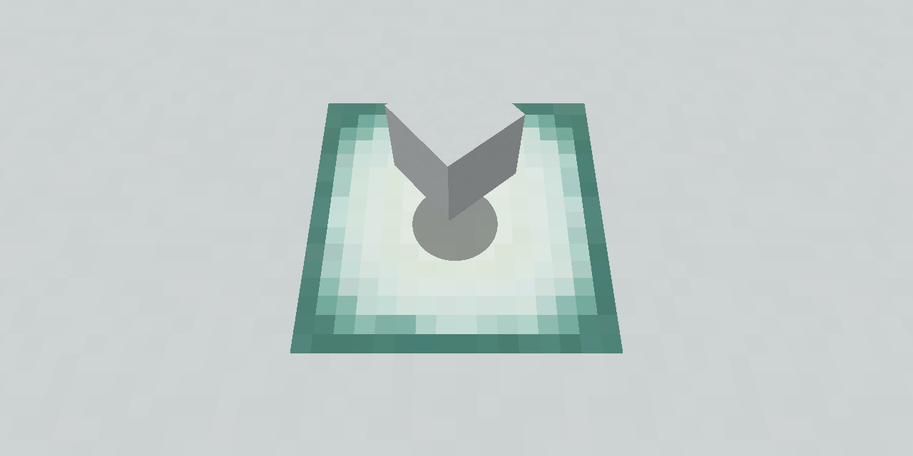

# Smooth Minecraft Shadows

Smooth Minecraft Shadows is the world's least useful Minecraft resource pack! It makes shadows under mobs super fancy and smooth.
Please credit me when sharing the file.

Go to the [Downloads](https://github.com/TheThunderGuyS/SmoothMinecraftShadows/releases).

Read my non-existing ["license"](LICENSE.md).

See the [Code of Conduct](CODE_OF_CONDUCT.md).

Here is a comparison of before and after enabling the pack:

The latest release is `1.1` for Minecraft: Java Edition `1.14.4`.

Installation instructions:
 1. Download the pack
 2. Put it in your `resourcepacks` folder
 3. Enable it and Enjoy!

**********
 

Changelog:

- 1.1 - September 25th, 2019:
  - The shadow texture is no longer blurred. This better fits the style of the game and won't make the shadow turn white at the ends.

- 1.0.2 - September 18th, 2019:
  - The pack no longer houses the entire GitHub repository so no more random useless updates with readme changes!
  
- 1.0.1.3 - September 7th, 2019:
  - Updated `LICENSE.MD` to version 1.1.2

- 1.0.1.2 - August 29th, 2019:
  - I promise this is the last readme change.
  - The pack is now known as "SmoothMinecraftShadows".
  - More reformatting to `README.MD`.

- 1.0.1.1 - August 28th, 2019:
  - Add dates to the changelog in `README.MD` as well as a image of the pack.
  - Fix an error in `LICENCE.MD` where it read "August 8th" rather than "August 28th".
  - Pack preview is now a comparison rather than a demo.
  - Removed version number from description, took up too much space.

- 1.0.1 - August 28th, 2019: 
  - Updated `README.MD` to make it fancy, adding a changelog and some links.
  - Updated the so called `"LICENCE.MD"` to be more functional.
  - Updated the `pack.png` to be more pixelated, like a Minecraft painting.
  - Updated the `pack.mcmeta` to now display my name and the version number.

- 1.0.0b - August 27th, 2019:
  - Fixed a spelling error and some formatting in `README.MD`.

- 1.0.0a - August 27th, 2019:
  - Initial *public* release.
  - Rename the pack to `"HD Shadows"`.
  - Adds a new `pack.png`.
  - Adds all of the documentation including `README.MD`, `LICENCE.MD` and `Preview.png`.

- 1.0.0 Release candidate 1, July 19th, 2019:
  - Initial private release in the form of `"4kShadows"`.
  
********************  
**End of Changelog**
