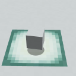
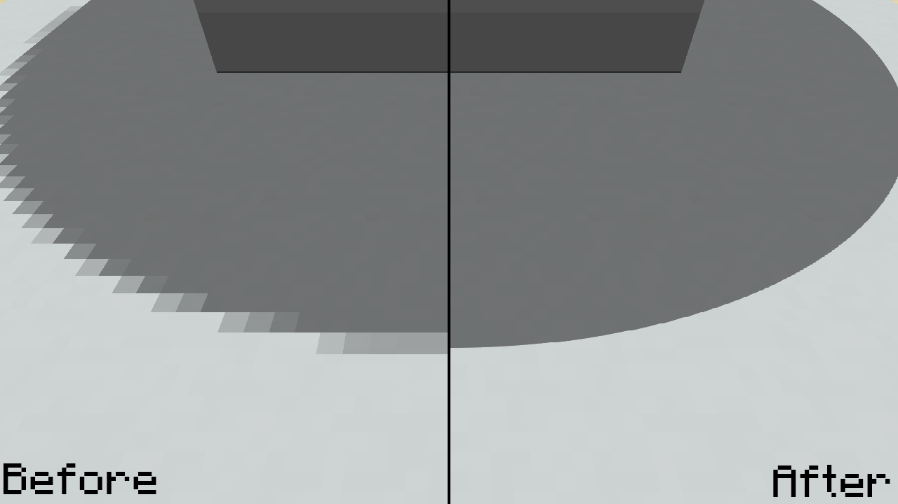
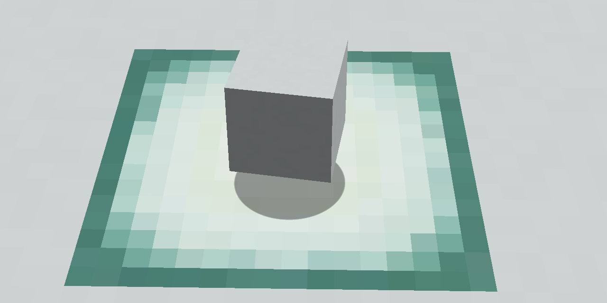

# Smooth Minecraft Shadows
This ~~code-free~~ resource pack that lives on GitHub was created so *you* can have fancy Smooth HD entity shadow thingies in Minecraft!

> Made by TheThunderGuy_S with MSPaint :P. 

Please credit me when sharing the file.
Read my non-existing "license" [here!](LICENSE.MD)

Share [this](https://github.com/TheThunderGuyS/SmoothMinecraftShadows/releases) link with your friends to brig them to the download page: `https://github.com/TheThunderGuyS/SmoothMinecraftShadows/releases`.

Here is a comparison:

Current version: `1.0.1.3`

Installation instructions:
 1. Download the pack
 2. Put it in your `resourcepacks` folder
 3. Enable it and Enjoy!

*******************************************
**End of documenttation. Changelog below:**
 

Changelog:

- 1.0.1.3, September 7th, 2019
  - Updated `LICENSE.MD` to version 1.1.2

- 1.0.1.2, August 29th, 2019:
  - I promise this is the last readme change.
  - The pack is now known as "SmoothMinecraftShadows".
  - More reformatting to `README.MD`.

- 1.0.1.1, August 28th, 2019:
  - Add dates to the changelog in `README.MD` as well as a image of the pack.
  - Fix an error in `LICENCE.MD` where it read "August 8th" rather than "August 28th".
  - Pack preview is now a comparison rather than a demo.
  - Removed version number from description, took up too much space.

- 1.0.1, August 28th, 2019: 
  - Updated `README.MD` to make it fancy, adding a changelog and some links.
  - Updated the so called `"LICENCE.MD"` to be more functional.
  - Updated the `pack.png` to be more pixelated, like a Minecraft painting.
  - Updated the `pack.mcmeta` to now display my name and the version number.

- 1.0.0b, August 27th, 2019:
  - Fixed a spelling error and some formatting in `README.MD`.

- 1.0.0a, August 27th, 2019:
  - Initial *public* release.
  - Rename the pack to `"HD Shadows"`.
  - Adds a new `pack.png`.
  - Adds all of the documentation including `README.MD`, `LICENCE.MD` and `Preview.png`.

- 1.0.0 Release canidate 1, July 19th, 2019:
  - Initial private release in the form of `"4kShadows"`.
  
********************  
**End of changelog**
********************
